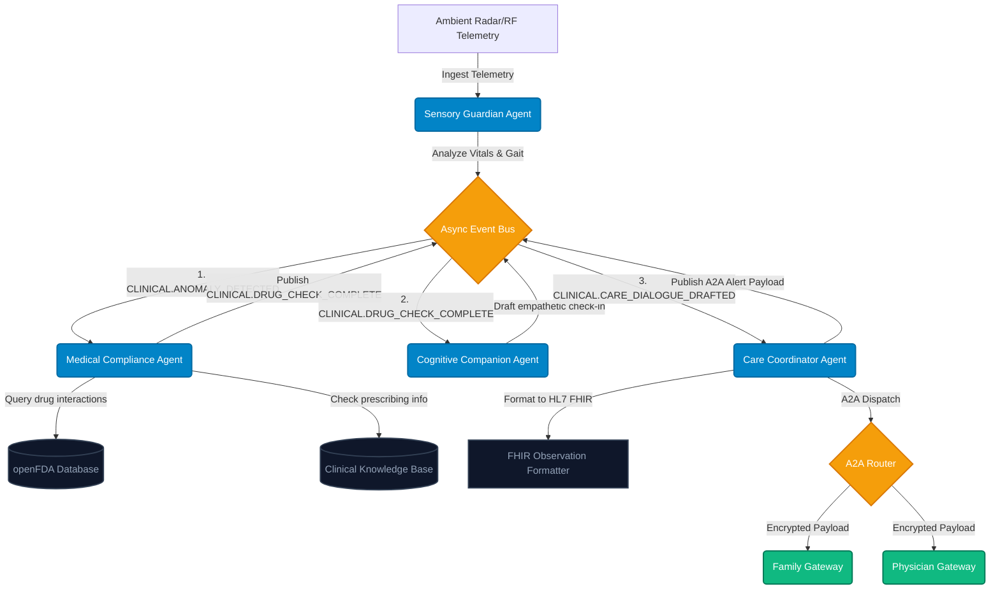

<p align="center">
  
</p>

<h1 align="center">SilverGrove</h1>
<p align="center"><strong>Privacy-First Multi-Agent Assisted Living Dashboard</strong></p>

<p align="center">
  <a href="#key-features">Key Features</a> •
  <a href="#asynchronous-architecture">Architecture</a> •
  <a href="#tech-stack">Tech Stack</a> •
  <a href="#getting-started">Getting Started</a>
</p>

---

**SilverGrove** is a privacy-first, enterprise-grade Ambient Assisted Living (AAL) multi-agent platform designed to bridge independent senior living, proactive health monitoring, and secure clinical collaboration. 

Powered by the **Google Agent Development Kit (ADK)** and the **Agent-to-Agent (A2A) protocol**, SilverGrove replaces invasive video surveillance with camera-free micro-radar ambient monitoring and orchestrates an advanced consensus pipeline to safely manage elderly patient wellness and polypharmacy risks.

---

## 🌟 Key Features

*   **🔒 Privacy-by-Design Ambient Telemetry**: camera-free ambient radar and RF sensors track gait speed, sleep quality, and daily vitals without invasive cameras, preserving senior dignity.
*   **⚡ Async Multi-Agent Consensus Pipeline**: Orchestrates specialized agents communicating asynchronously via a high-performance in-memory Event Bus for concurrent, multi-layered clinical evaluation.
*   **💊 Automated Polypharmacy Correlation**: Integrates with live **openFDA** drug databases to instantly cross-reference gait and biometric anomalies against active prescriptions (e.g. beta-blockers like Metoprolol Succinate).
*   **🤝 Secure A2A Protocol Routing**: Packages consensus clinical summaries into cryptographically structured A2A Agent Cards, securely dispatching telemetry directly to Family and Physician gateways.
*   **🏥 HL7 FHIR Interoperability**: Generates standards-compliant FHIR R4 Observations tagged with strict LOINC codes and UCUM units to enable direct integration into enterprise Electronic Health Records (EHRs).
*   **📄 Seamless Dynamic Clinical Reports**: Compiles instant, localized PDF clinical charts using hardened string-cleansing algorithms to protect against layout/encoding crashes.

---

## 🏗️ Asynchronous Architecture

SilverGrove deploys an event-driven Multi-Agent System (MAS). Instead of rigid, sequential scripting, agents concurrently publish and subscribe to clinical event streams using an `asyncio`-powered Event Bus.

### Multi-Agent Flow Diagram



### Specialized Agents

1.  **Sensory Guardian** (`agents/sensory_guardian.py`): Ingests sensor streams (micro-radar gait velocity, respiratory rates, heart rate) and flags deviations of $\ge 15\%$ against patient baselines.
2.  **Medical Compliance** (`agents/medical_compliance.py`): Receives anomaly events, polls openFDA APIs, and determines if new medications (e.g. Metoprolol, Lisinopril) are causing orthostatic hypotension.
3.  **Cognitive Companion** (`agents/cognitive_companion.py`): Receives clinical checkouts and structures friendly, daily safety advice tailored for senior residents to keep them safe and active.
4.  **Care Coordinator** (`agents/care_coordinator.py`): Compiles the entire consensus, formats biometric data as HL7 FHIR observations, creates standardized A2A dispatch cards, and publishes them to connected channels.

---

## 🛠️ Tech Stack

*   **Core Orchestration**: Google Agent Development Kit (ADK), Google GenAI SDK (Gemini 3.1 Flash Lite / Pro)
*   **Protocol Standard**: Agent-to-Agent (A2A) specifications for Agent Cards
*   **Asynchronous Engine**: Python `asyncio` Task Groups, FastAPI Event loop
*   **Data & APIs**: openFDA API, HL7 FHIR R4 Standards
*   **PDF Generation**: Hardened `FPDF2` Clinical Engine
*   **Frontend**: High-fidelity, reactive glassmorphism dashboard (HTML5, Vanilla CSS, JS)
*   **CI/CD & Cloud Deployment**: GitHub Actions, Google Artifact Registry, Google Cloud Run

---

## 🚀 Getting Started

### 1. Configure Environments
Create a `.env` file in the root directory:
```bash
GEMINI_API_KEY=your_google_ai_studio_api_key_here
ENV=production
```

### 2. Setup Dependencies
```bash
# Clone the repository
git clone https://github.com/sunerasamuditha/SilverGrove.git
cd SilverGrove

# Install core packages
pip install google-adk google-genai fastapi uvicorn python-dotenv fpdf2 requests
```

### 3. Run the System
```bash
python main.py
```
Open your browser and navigate to `http://localhost:8180` to experience the live simulation and Command Center dashboard!

